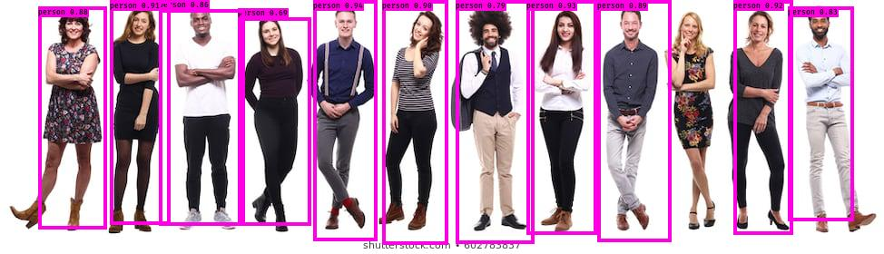
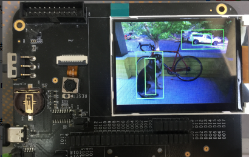

# K210-yolo3

[](LICENSE)

## Introduction

A Tensorflow implementation of [keras-YOLOv3](https://github.com/qqwweee/keras-yolo3). Now I am ported to k210 ~

**This code lacks scalability and good measurements during training, so I rewrote a [K210 Yolo v3 framework](https://github.com/zhen8838/K210_Yolo_framework).**

---

## Quick Start

## Set Environment

See `requirements.txt`

## Prepare Dataset

1.  download dataset:

    ```sh
    wget https://pjreddie.com/media/files/VOCtrainval_11-May-2012.tar
    wget https://pjreddie.com/media/files/VOCtrainval_06-Nov-2007.tar
    wget https://pjreddie.com/media/files/VOCtest_06-Nov-2007.tar
    tar xf VOCtrainval_11-May-2012.tar
    tar xf VOCtrainval_06-Nov-2007.tar
    tar xf VOCtest_06-Nov-2007.tar
    ```

2.  Generate annotation file and class names file.  

    One row for one image;  
    Row format: `image_file_path box1 box2 ... boxN`;  
    Box format: `x_min,y_min,x_max,y_max,class_id` (no space).  
    For VOC dataset, try 
    
    ```sh
    python3 voc_annotation.py your-path/VOCdevkit/
    cat 2007_*.txt 2012_*.txt > train.txt
    ```  
    
    Here is an example:
    
    ```
    path/to/img1.jpg 50,100,150,200,0 30,50,200,120,3
    path/to/img2.jpg 120,300,250,600,2
    ...
    ```

## Train Mobilenet 

```sh
usage: train.py [-h] [--alpha {0.5,0.75,1.0}]
                [--annotation_path ANNOTATION_PATH]
                [--weights_path WEIGHTS_PATH] [--learning_rate LEARNING_RATE]
                [--classes_path CLASSES_PATH] [--anchors_path ANCHORS_PATH]
                [--epochs EPOCHS] [--augment {True,False}]
```

1.  train mobilenet yolo3 alpha = xx

    ```sh
    python3 train.py --alpha xx
    ```

2. load pre-train model

   ```sh
   python3 train.py --weights_path logs/xxxx-xxxx/yolo_model_body.h5
   ```
    
**NOTE:** Default training 10 epochs,data augment = True 

## Test

```sh
python3 yolo_video.py --model logs/xxxxxxxx/yolo_model_body.h5 --anchors model_data/tiny_yolo_anchors.txt --classes model_data/voc_classes.txt --image
```

Then type the image path.

You can try with the model which I trained the 20 epochs mobilenet 0.75 model:

```sh
python3 ./yolo_video.py --model model_data/yolo_model_body_75.h5  --anchors model_data/tiny_yolo_anchors.txt --classes model_data/voc_classes.txt --image
```

Then type `model_data/people.jpg`:



## Freeze

```sh
toco --output_file yolo_model.tflite --keras_model_file logs/xxxxxxxx/yolo_model_body.h5
```


## Convert

Please use latest [nncase](https://github.com/kendryte/nncase)
```sh
ncc -i tflite -o k210model --channelwise-output --dataset ./images mobile_yolo.tflite ./yolo.kmodel
```


## Demo

Use [Kflash.py](https://github.com/kendryte/kflash.py) download `kpu_yolov3_test/kfpkg/kpu_yolov3.kfpkg` to KD233 board:

```sh
kflash kpu_yolov3_test/kfpkg/kpu_yolov3.kfpkg -B kd233 -p /dev/ttyUSB0 -b 2000000 -t
```

**NOTE:** I've just shown the most basic example to prove the validity of the model if you need to use at least the non-maximum suppression between multiple layers of output in your code.



## Issue

If you have any issue, contact me by QQ:`597323109` or email:`597323109@qq.com`

## Some issues to know

1. **Default anchors are used.** If you use your own anchors, probably some changes are needed.

2. The inference result is not totally the same as Darknet but the difference is small.

3. The speed is slower than Darknet. Replacing PIL with opencv may help a little.

4. Always load pretrained weights in the first stage of training. Or try Darknet training. It's OK if there is a mismatch warning.

5. The training strategy is for reference only. Adjust it according to your dataset and your goal. And add further strategy if needed.

6. For speeding up the training process with frozen layers train_bottleneck.py can be used. It will compute the bottleneck features of the frozen model first and then only trains the last layers. This makes training on CPU possible in a reasonable time. See [this](https://blog.keras.io/building-powerful-image-classification-models-using-very-little-data.html) for more information on bottleneck features.


